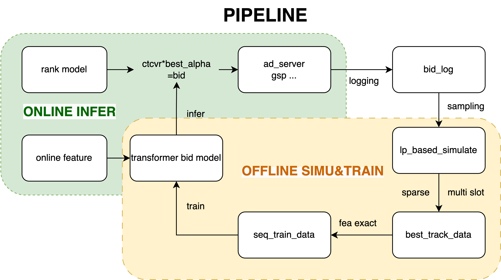
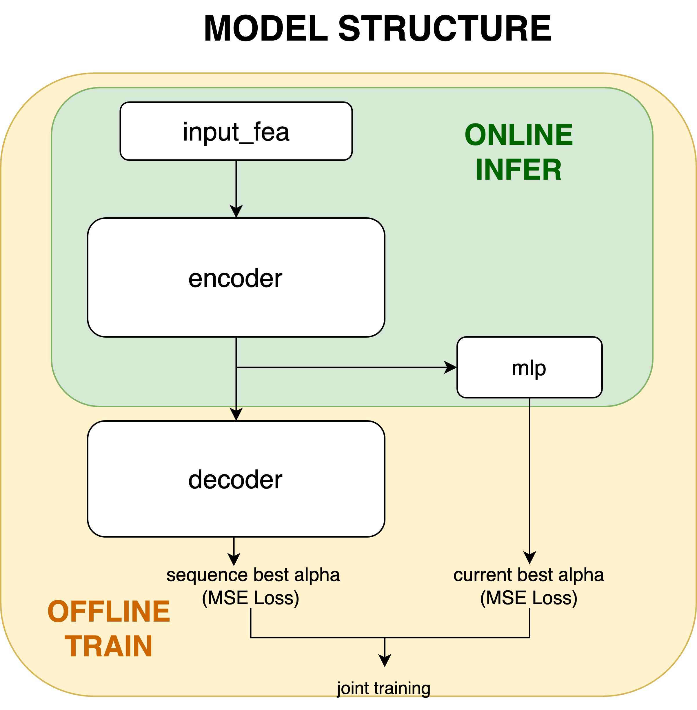

## Problem Defintion: 

When future traffic is known, the problem can be formulated as a constrained multi-objective optimization. Using Linear Programming (LP), the optimal bidding formula is derived: bid=α0​⋅Vi​+α1​⋅C⋅Vi​. However, in real-world auctions, complexities arise due to unknown future traffic, multiple ad slots with varying exposure rates, and fluctuating rank model coefficients.

## Solution Pipeline:

1. SIMULATOR

Using auction log data, we construct an optimization problem for each timeslot. LP is applied to solve the optimal bidding strategy. During this process, we take into account factors such as multiple slots and convert data sparsity, and we make reasonable adjustments and corrections to the solution. Then, based on the optimal bidding results, the corresponding sequential features are generated for training the model.

2. TRAIN TRANSFORMER MODEL

In the model-building stage, we use optimal bidding sequences to train a time-series model. The Transformer model with an encoder-decoder structure is adopted to capture temporal dependencies and the complex dynamics of the auction.The input features are:static features(e.g., budget, CPA, category...),sequential bidding features(e.g., pValue and budget left...). During training, the encoder-decoder structure is used to regress the entire sequence of optimal bids. The encoder output is passed through an MLP to predict the optimal bid for the current timeslot, enabling joint training. This helps the model capture long-term dependencies and speeds up convergence using the Teacher-Forcing method.

3. ONLINE INFERENCE

In inference, only the encoder is used to predict the optimal bid for current timeslot, reducing computational costs and avoiding exposure bias from Teacher-Forcing during training.

## Online Ad Delivery Performance Analysis:

Comparison from LP strategy to the final Transformer model: 
1. Delivery Smoothness and Budget Consumption: 33.3% of LP advertisers ran in the final hour, compared to 89.6% in the final strategy.Budget Consumption Rate: 70.9% (LP) vs. 95.4% (Final), showing more efficient budget usage. 
2. Over-budget Situations: CPA exceedance (20% over budget): 39.58% (LP) vs. 31.25% (Final), showing fewer over-budget cases in the final strategy.
